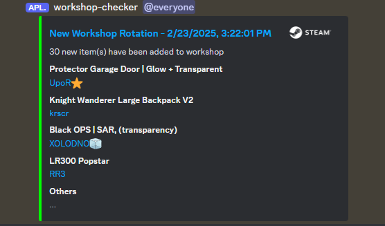
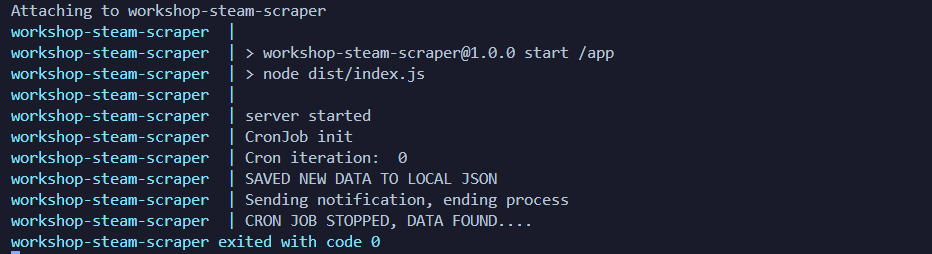

# Workshop scraper

This project is a web scraper for the Steam Workshop, specifically designed to scrape newest added items from the Rust Workshop. It fetches the latest workshop items, stores them locally, and sends notifications to a Discord channel whenever new items are added.

- sends notifications to a Discord channel whenever new items are added, storing items locally and ending the script.
- if local items are found, it compares them with the latest items on the website and sends notifications to a Discord channel whenever new items are added.
- if no local items are found, it fetches the latest workshop items, stores them locally, and sends notifications to a Discord channel whenever new items are added.
- if items didn't change, it will repeat the process after a specified time (cron job).

## Preview

### Dicord notification



### Running script scraping Rust Workshop



## Installation

Create .env file in the root directory with the following content:

```bash
DC_BOT_TOKEN=
SERVER_ID=
PROXY=
URL_TO_PARSE=
TIME_STAMP=
```

Run command:

```bash
docker-compose up --build
```

## Requirements

- Docker
